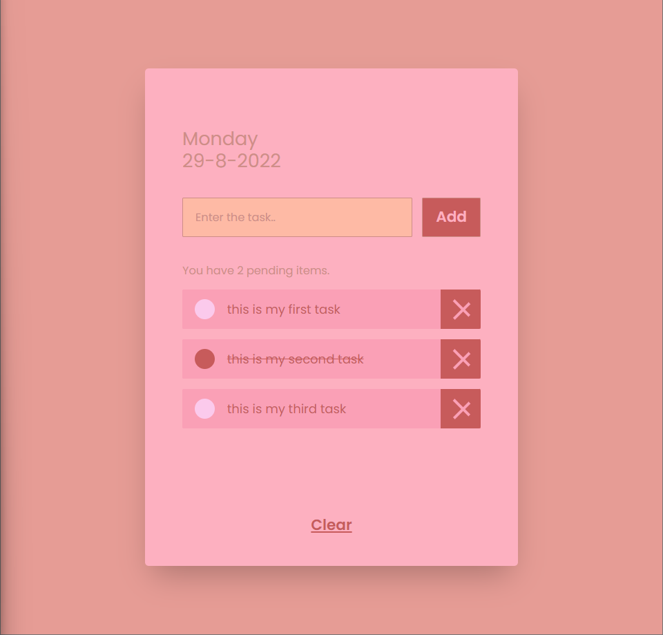

# TODO-LIST

## _A simple todo-list app made with react and tailwind CSS_

Todo-list is a program were you can add list of tasks you need to complete or things
that you want to do. This will help you to trace your productivity progress.



## Features

- Manage your task easily and quickly
- Easy to use, with simple User Interface
- Beautiful and great UI design

## Tech

Todo-List uses a number of open source projects to work properly:

- [ReactJS] - A JavaScript library for building user interfaces
- [TailwindCSS] - A utility-first CSS framework for modern web apps
- [node.js] - evented I/O for the backend

And of course Todo-List itself is open source with a [public repository]
on GitHub.

## Installation

Todo-List requires [Node.js](https://nodejs.org/) v10+ to run.

Install the dependencies and devDependencies and start the server.

```sh
cd todo-list
npm i
npm start
```

**Thank you for using and taking interest in my first project. It is very encouraging. I will continue to work hard on my projects and contribute as much as possible to others.**

[public repository]: https://github.com/haseeb-official/todo-list
[reactjs]: https://reactjs.org/
[tailwindcss]: https://tailwindcss.com/
[node.js]: https://nodejs.org/
